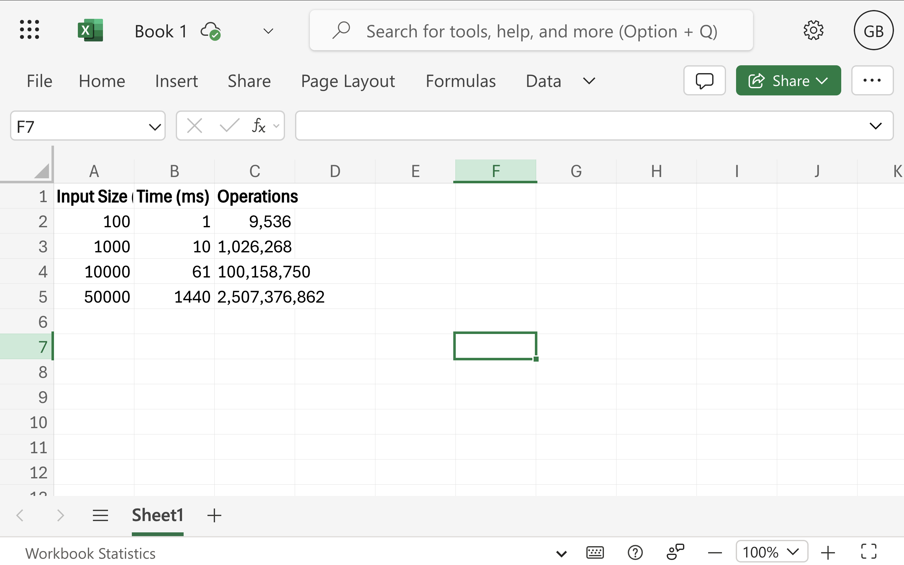

Assignment 2 – Algorithmic Analysis and Peer Code Review

 Gaziza Bakir

 Insertion Sort

 Insertion Sort is a simple comparison-based sorting algorithm. It builds the sorted array one element at a time by comparing and inserting elements into their correct positions.

 Pseudocode

for i ← 1 to n−1 do

    key ← A[i]

    j ← i − 1

    while j ≥ 0 and A[j] > key do

        A[j + 1] ← A[j]

        j ← j − 1

    A[j + 1] ← key 

The algorithm works efficiently for small or partially sorted datasets, but becomes slow for large ones because of its quadratic time complexity.

Ω(n) Best case: The array is already sorted, so only one comparison per element.

Θ(n²) Average Case: Each element is compared with half of the previous elements on average.

O(n²) Worst Case: The array is reverse-sorted, requiring maximum comparisons and shifts.

O(1) Space Complexity: The algorithm sorts in place without extra memory.
Stable : Equal elements remain in their original order.

Experimental Evaluation

Project Structure

assignment2

├── src/

│   ├── main/java/

│   │   ├── algorithms/InsertionSort.java

│   │   ├── metrics/PerformanceTracker.java

│   │   └── cli/BenchmarkRunner.java

│   └── test/java/

│       └── algorithms/InsertionSortTest.java

├── docs/

│   ├── performance-table.png

│   └── analysis-report.pdf

├── pom.xml

└── README.md

How to Run

To compile and run the program:
mvn compile
mvn exec:java -Dexec.mainClass="cli.BenchmarkRunner"

To run unit tests:
mvn test

The benchmark results are printed in the console after execution.

